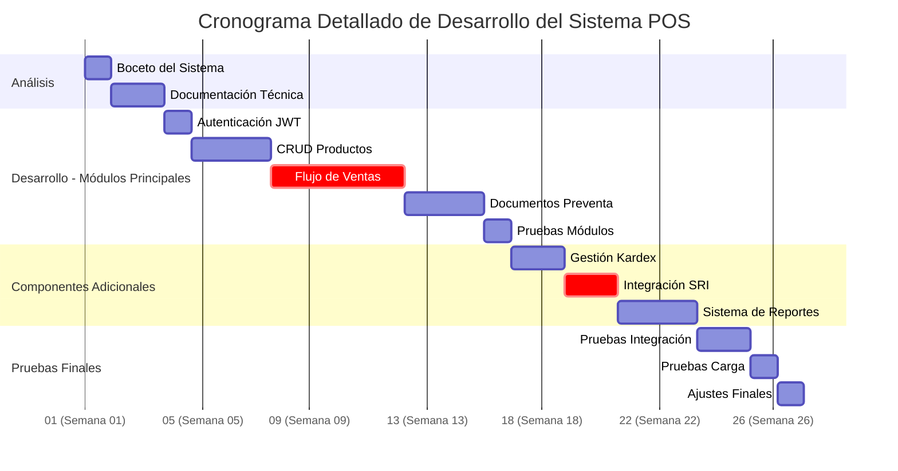

# Cronograma de desarolo del sistema POS

<!--

-->

## 1. Leyenda:

- **:crit**: Tareas críticas (camino crítico)
- **:milestone**: Hito importante
- **semanas**: Se muestran como %U (número de semana)

## 2. Fases detalladas:

### `Análisis (Semanas 1-2)`

- **1 semanas**: Boceto del sistema (db - funcionalidades)
- **2 semanas**: Documentación técnica (digramas, requerimientos, cronograma)

### `Desarrollo - Módulos Principales (Semanas 3-15)`

- **Semanas 3**: Autenticación JWT + (tablas usuarios/roles)
- **Semanas 4-6**: CRUD Productos con atributos/variaciones
- **Semanas 7-11**: Flujo completo de ventas (con clientes/detalle)
- **Semanas 12-14**: Documentos preventa (cotizaciones → ventas)
- **Semanas 15**: Pruebas (unitarias, integración, carga/rendimientocarga/rendimiento)

### `Componentes Adicionales (Semanas 15-21)`

- **Semanas 15-16**: Kardex (movimientos de inventario)
- **Semanas 17-18**: Integración SRI (comprobantes electrónicos)
- **Semanas 19-21**: Reportes (ventas, inventario)
