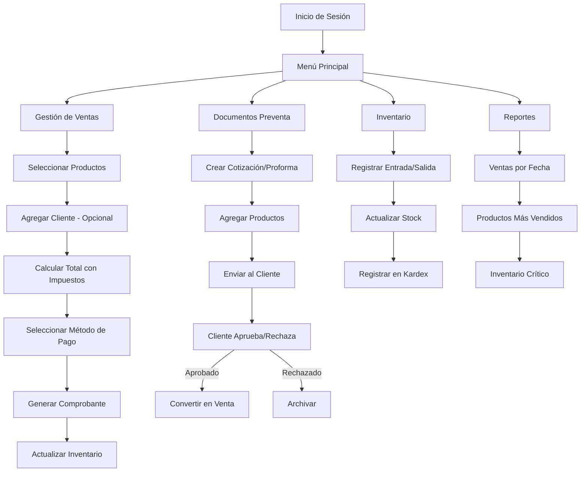
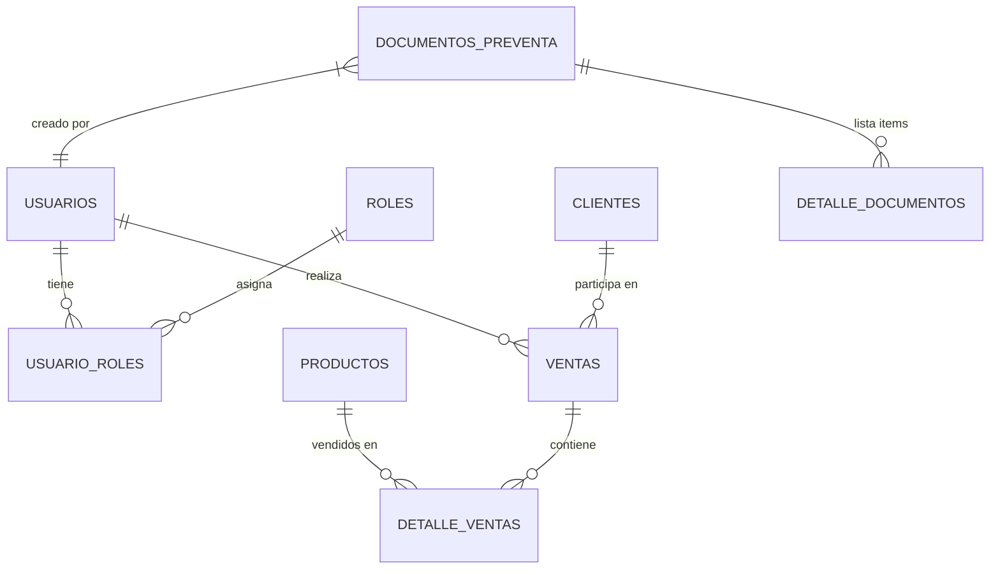
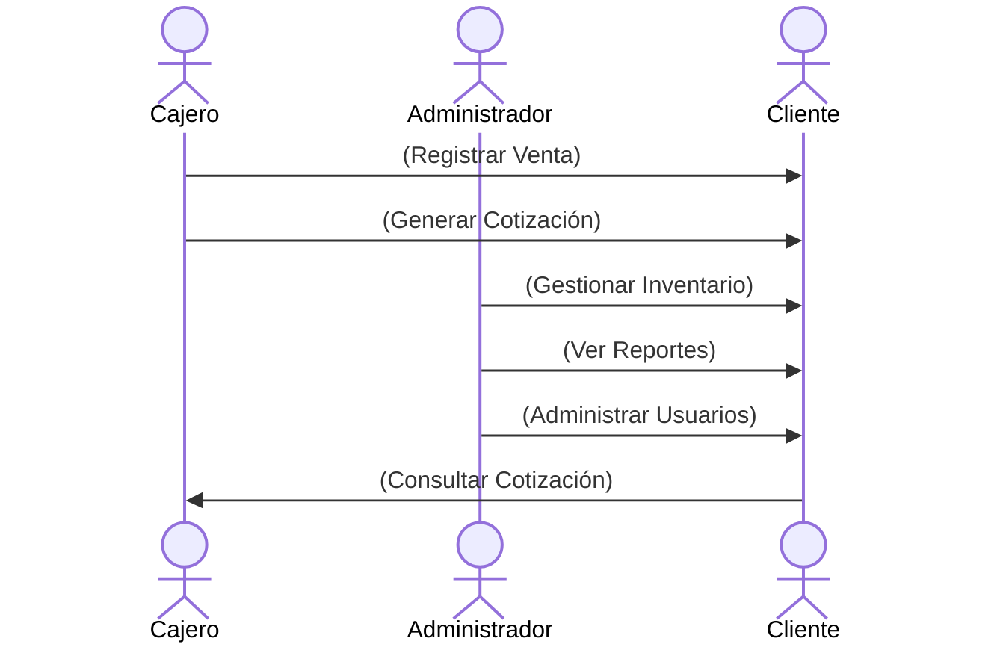
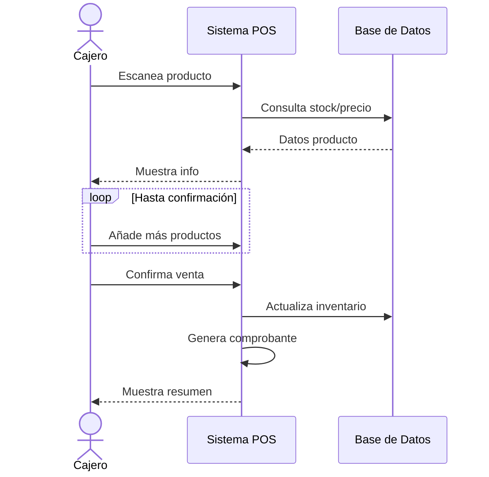
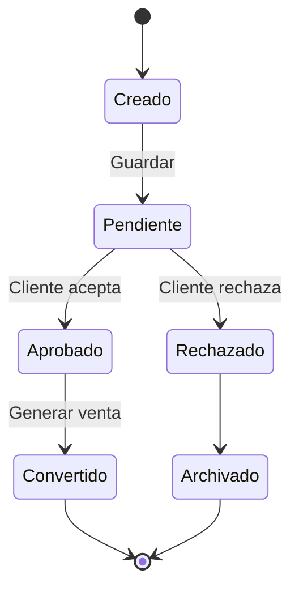
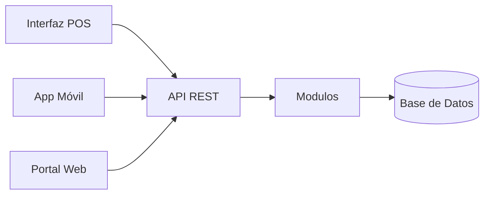

# Documentación Técnica: Flujo del Sistema POS

## 1. Estructura de la Base de Datos

El sistema POS está diseñado con una estructura de base de datos relacional que consta de las siguientes tablas principales:

### **1.1 Tablas Principales**

- **usuarios**: Almacena información de los usuarios del sistema
- **roles_pos**: Define los diferentes roles con sus niveles de acceso
- **usuario_roles**: Relación muchos-a-muchos entre usuarios y roles

### **1.2. Gestión de Productos**

- **productos**: Información básica de productos
- **categorias**: Clasificación de productos
- **atributos_producto y valores_atributo_producto**: Atributos personalizados
- **variaciones y variaciones_precio**: Manejo de variantes de productos

### **1.3. Inventario**

- **kardex_pos**: Registro detallado de movimientos de inventario
- **proveedores**: Información de proveedores
- **pagos**: Registro de pagos a proveedores

### **1.4. Ventas y Clientes**

- **clientes**: Datos de clientes
- **ventas y detalle_ventas**: Transacciones de venta
- **comprobantes_fisicos y comprobantes_electronicos**: Documentos legales

### **1.5.Documentos Preventa**

- **documentos_preventa**: Cotizaciones y proformas
- **detalle_documentos_preventa**: Items de documentos preventa
- **seguimiento_documentos_preventa**: Historial de cambios

### **1.6. Configuración**

- **informacion_local**: Datos del negocio
- **impuestos**: Configuración de tasas impositivas

---

## 2. Requisitos Funcionales

### **2.1. Gestión de Usuarios y Accesos**

- Registro y autenticación de usuarios
- Asignación de roles con diferentes niveles de acceso (vistas absolutas)
- Control de actividades mediante registro de acciones

### **2.2. Gestión de Productos**a

- CRUD completo de productos con categorías
- Manejo de atributos personalizados
- Control de variantes y precios especiales
- Gestión de impuestos aplicables

### **2.3. Gestión de Inventario**

- Registro de entradas y salidas (kardex)
- Control de stock en tiempo real
- Alertas de bajo inventario
- Movimientos con costo unitario y total

### **2.4. Procesos de Venta**

- Registro de ventas con múltiples métodos de pago
- Generación de comprobantes físicos y electrónicos
- Manejo de clientes (registrados y ocasionales)
- Conversión de documentos preventa en ventas reales

### **2.5. Documentos Preventa**

- Generación de cotizaciones y proformas
- Seguimiento de estados (pendiente, aprobada, rechazada)
- Cálculo automático de subtotales, impuestos y totales
- Historial de modificaciones

### **2.6. Reportes y Análisis**

- Ventas por período, producto, categoría, vendedor
- Movimientos de inventario
- Documentos preventa por estado
- Rendimiento de vendedores

---

## 3. Flujos de Trabajo Principales

### **3.1. Proceso de Venta**

- Selección de productos
- Asignación de cantidades
- Aplicación de descuentos (si aplica)
- Selección de cliente (opcional)
- Cálculo automático de impuestos
- Selección de método de pago
- Generación de comprobante

### **3.2. Proceso de Documento Preventa**

- Creación de documento (cotización/proforma)
- Adición de productos y cantidades
- Aprobación/rechazo por parte del cliente
- (Opcional) Conversión a venta real
- Generación de PDF para envío al cliente

### **3.3. Proceso de Gestión de Inventario**

- Registro de entrada de mercancía
- Actualización automática de stock
- Registro en kardex con costos
- Alertas de stock bajo (10 defecto - configurable)

## 4. Requisitos No Funcionales

### **4.1.Seguridad**

- Autenticación con contraseñas encriptadas
- Control de acceso basado en roles
- Registro de actividades críticas

### **4.2. Rendimiento**

- Respuesta rápidas para operaciones comunes

### **4.3. Disponibilidad**

- Funcionamiento 24/7 con mantenimiento programado
- Sistema de backup automático diario (caracteristica de pago)

### **5.4. Integraciones**

- Generación de comprobantes electrónicos - SRI

### **5.5 Escalabilidad**

- Soporte para crecimiento en número de productos, usuarios y transacciones

## 5. Consideraciones Técnicas

- **Base de Datos**: PostgreSQL recomendado por su soporte para transacciones complejas
- **Backend**: API REST con autenticación JWT
- **Frontend**: Aplicación web responsive para escritorio y móvil
- **Reportes**: Generación de PDF y formatos exportables (Excel, CSV)

## Diagramas

### 1. Flujo General del Punto de Venta (POS)

### 2. Diagrama de Entidad-Relación (ER) Simplificado

### 3. Casos de Uso - Simplificado

### 4. Diagrama de Secuencia de una Venta Rápida

Interacción entre Usuario, Sistema e Inventario

### 5. Diagrama de Estados de un Documento Preventa

Transiciones de Estados (Cotización/Proforma)

### 6. Arquitectura del Sistema

